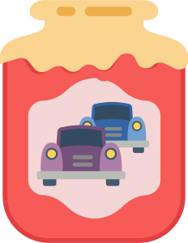

# Traffic Jam API

API server for managing traffic jams

## API documentation

The API is available on Swagger Hub:
[Traffic Jam API](https://app.swaggerhub.com/apis/peterjochum/traffic-jam_api/1.1.0)

## Build

Build the docker image

    docker build -t traffic-jam-api:latest .

## Run

Run the server

    docker run --rm -p 8090:8090 -e TJ_MODE=dev -e TJ_PORT=8090 traffic-jam-api:<tagname>

Test the API

[http://localhost:8090/api/v1/trafficjam](http://localhost:8090/api/v1/trafficjam)

## Uses

### Programming

- Golang
- Gorilla mux

### Graphics

The logo is a composite of two very nice icons:

- Jam icon by [icon king1](https://freeicons.io/profile/3) on [freeicons.io](https://freeicons.io)
  
  Changes: removed cherry
- Car icon by [Raj Dev](https://freeicons.io/profile/714) on [freeicons.io](https://freeicons.io)
  
  Changes: changed color, placed above each other
                                
                                